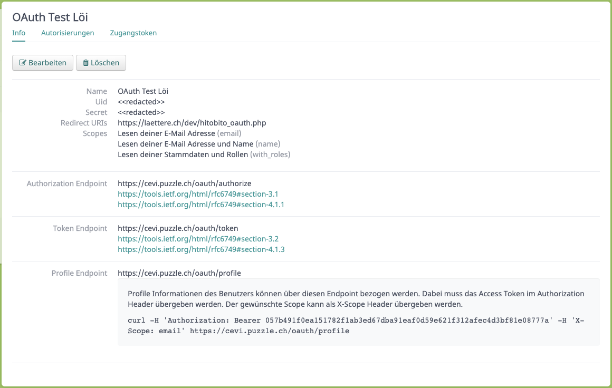

# OAuth Login mit Hitobito
Hitobito bietet ab der Version 1.20 eine OAuth Schnittstelle. Um OAuth Applikationen zu erfassen ist eine Administrationsrolle auf der obersten Ebene erforderlich. Die die offizielle Dokumentation der Schnittstelle: [hitobito/doc/development/08_oauth.md](https://github.com/hitobito/hitobito/blob/master/doc/development/08_oauth.md)

## Beispiel mit PHP
In diesem Repository findet sich eine Beispiel Implementation mit PHP: [PHP/hitobito_oauth.php](PHP/hitobito_oauth.php). Das Beispiel ist [Hier](https://laettere.ch/dev/hitobito_oauth.php) aufgeschalten und mit der CeviDB Integrations Umgebung [cevi.puzzle.ch](https://cevi.puzzle.ch) verknüpft.

### Konfiguration
```php
// hitobito oauth urls
const hitobito_oauth_authorization_endpoint = '';
const hitobito_oauth_token_endpoint = '';
const hitobito_oauth_profile_endpoint = '';

// oauth client id and secret
const hitobito_oauth_uid = '';
const hitobito_oauth_secret = '';

// profile scope, has to match with settings in hitobito
// one or more out of [email | name | with_roles]
const hitobito_oauth_scope = 'email name with_roles';

// own redirect url, has to match with settings in hitobito
const redirect_uri = '';

```

